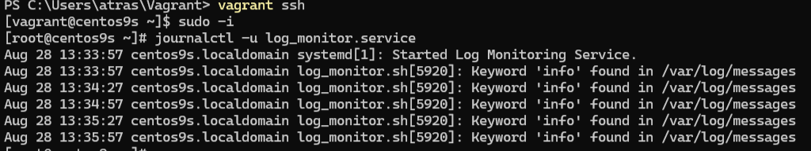
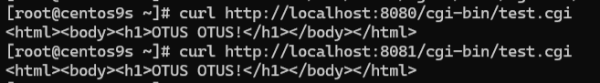
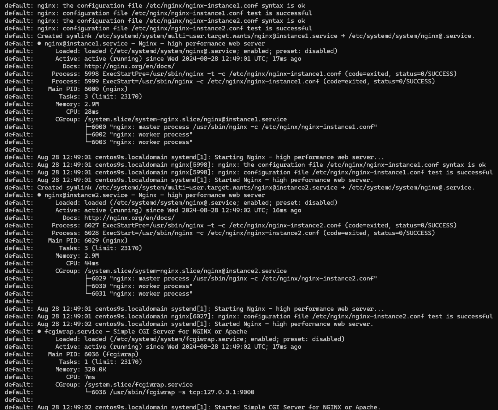

# Настройка и запуск сервисов через Vagrant

### Почему используем GitHub для хранения скриптов выполнения

Так как при попытке выполнения ДЗ только через vagrant наблюдались проблемы с экранированием при заполнении файлов, то решено отдельно создать скрипты, залить их в GitHub и скачивать через wget при провижининге при создании нашей ВМ.

---

#### 1. **Сервис для мониторинга логов**
- **Задание:** Создать сервис, который раз в 30 секунд будет проверять лог-файл на наличие определенного ключевого слова. Путь к файлу лога и само ключевое слово должны задаваться в отдельном конфигурационном файле `/etc/default`.

- **Решение:**
  - В Vagrantfile:
    - **Скрипт `1.sh`** создает мониторинговый скрипт `/usr/local/bin/log_monitor.sh`, который проверяет файл лога на наличие ключевого слова каждые 30 секунд.
    - **Скрипт `2.sh`** создает конфигурационный файл `/etc/default/log_monitor` с параметрами для мониторинга (путь к логу и ключевое слово `info`).
    - **Скрипт `3.sh`** создает `unit`-файл `log_monitor.service` для запуска мониторингового скрипта как системной службы.
    - Сервис `log_monitor` запускается с помощью команд `systemctl enable` и `systemctl start`.
    - Проверили, что сервис работает, командой `journalctl -u log_monitor.service` и добавили тестовое сообщение в лог-файл, чтобы убедиться, что сервис его обнаруживает.

_Проверка вывода логов_

---

#### 2. **Настройка CGI-сервера `fcgiwrap`**
- **Задание:** Установить и настроить `spawn-fcgi`, а также создать `unit`-файл для его запуска. 

- **Решение:**
  - В Vagrantfile:
    - Так как `spawn-fcgi` недоступен в CentOS 9, мы использовали `fcgiwrap` в качестве альтернативы.
    - **Скрипт `4.sh`** создает `unit`-файл `fcgiwrap.service`, который запускает `fcgiwrap` как службу, настроив его на использование TCP-порта `9000`.
    - Запускается `fcgiwrap` с помощью команд `systemctl enable` и `systemctl start`.
    - Проверяется статус службы командой `systemctl status fcgiwrap` и выполняются тестовые запросы с помощью `curl` по адресам `http://localhost:8080/cgi-bin/test.cgi` и `http://localhost:8081/cgi-bin/test.cgi`.

_Проверка тестовыми запросами_

---

#### 3. **Настройка Nginx для запуска нескольких инстансов**
- **Задание:** Модифицировать `nginx.service` для запуска нескольких экземпляров Nginx с разными конфигурационными файлами одновременно.

- **Решение:**
  - В Vagrantfile:
    - **Скрипт `5.sh`** создает `unit`-файл `nginx@.service`, который позволяет запускать несколько экземпляров Nginx с разными конфигурационными файлами.
    - Настроены уникальные порты и PID-файлы для каждого экземпляра Nginx.
    - **Скрипт `6.sh`** добавляет нужные настройки для CGI в конфигурационные файлы Nginx.
    - **Скрипт `7.sh`** создает тестовый CGI-сценарий `/usr/share/nginx/html/cgi-bin/test.cgi`.
    - Запустили и проверили оба экземпляра Nginx с помощью команд `systemctl enable`, `systemctl start` и `systemctl status`.
    - Убедились, что оба экземпляра Nginx работают корректно, и CGI-сценарии выполняются, используя `curl`.

_Проверка статуса служб двух экзепмляров Nginx_

---

### По итогу:

1. Сервис мониторинга логов настроен и работает корректно — ✔
2. `fcgiwrap` настроен и работает нормально для обработки CGI-запросов — ✔
3. Несколько инстансов Nginx настроены и работают корректно — ✔
