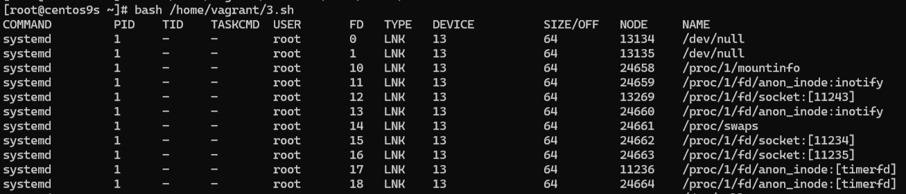

# Скрипт для отображения открытых файлов в системе

## Как работает скрипт

1. **Вывод заголовка таблицы с названиями столбцов, такими же как и в `lsof`**  

2. **Перебор всех процессов в системе:**  
   Проходим по каждому каталогу в `/proc`, который имеет числовое имя (отсеиваем непроцессы).

3. **Получение информации о процессе:**  
   Для каждого процесса получаем имя (`COMMAND`) и имя юзера (`USER`), который запустил этот процесс.

4. **Перебор всех открытых FD:**  
   Перебираем все файлы в каталоге `/proc/*/fd`, которые представляют собой открытые файлы для данного процесса.

5. **Сбор информации о каждом дескрипторе файла:**  
   Для каждого открытого файла мы собираем следующие данные:
   - Полный путь к файлу.
   - Номер дескриптора файла (`FD`).
   - Тип файла (`TYPE`).
   - Номер устройства (`DEVICE`), на котором расположен файл.
   - Размер файла или смещение (`SIZE/OFF`).
   - Номер inode файла (`NODE`).

6. **Вывод информации в табличном формате, аналогично `lsof`**  

_вывод скрипта_
