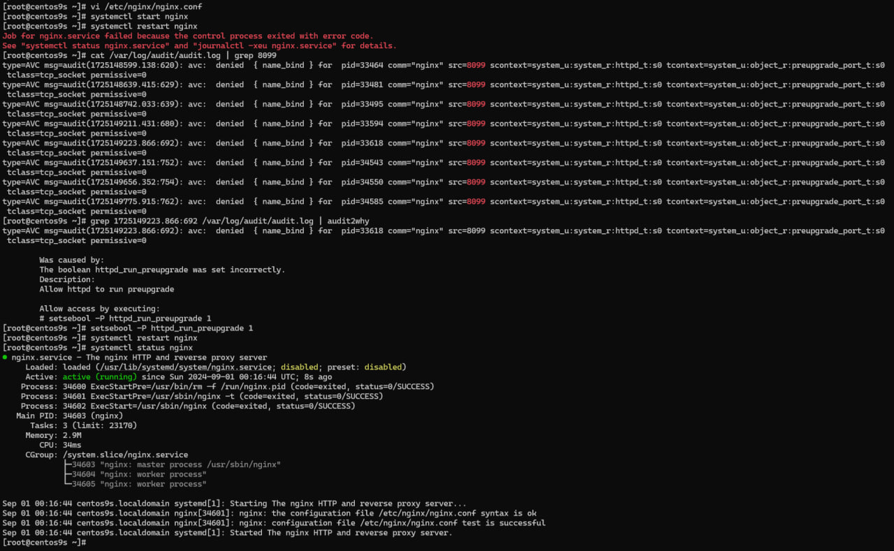
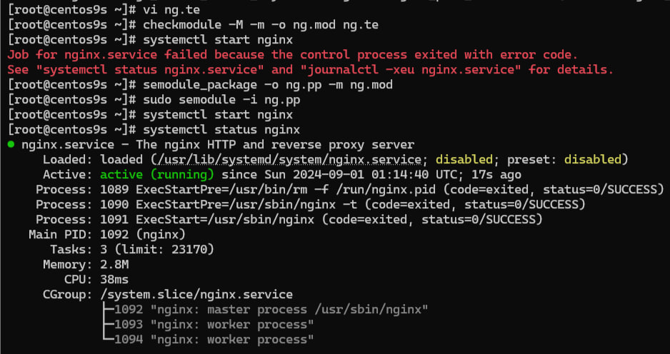

## SELinux: Разрешение нестандартного порта для Nginx

### 1. Способ: Использование переключателя SELinux

Сначала используется встроенный переключатель SELinux для разрешения выполнения предустановленных обновлений веб-сервером:

```bash
sudo setsebool -P httpd_run_preupgrade 1
```
  

_SELinux Boolean_

Эта команда включает возможность для Nginx выполнять действия, связанные с предустановленными обновлениями, что может включать использование нестандартных портов.

### 2. Способ: Добавление нестандартного порта в список разрешенных для веб-серверов

Далее изменяется тип порта `8099` на `http_port_t`, который SELinux разрешает использовать веб-серверам:

```bash
sudo semanage port -m -t http_port_t -p tcp 8099
```
  

_Добавление нестандартного порта_

Эта команда позволяет Nginx прослушивать порт `8099`, изменяя его тип на тот, который разрешен для использования веб-серверами.

### 3. Способ: Создание и установка пользовательского модуля SELinux

В этом шаге создается и устанавливается собственный модуль SELinux, чтобы явно разрешить процессам Nginx привязываться к порту с типом `preupgrade_port_t`:

- Создается файл политики `ng.te`:

    ```plaintext
    module ng 1.0;

    require {
        type httpd_t;
        type preupgrade_port_t;
        class tcp_socket name_bind;
    }

    # Разрешить httpd_t (Nginx) привязываться к порту preupgrade_port_t
    allow httpd_t preupgrade_port_t:tcp_socket name_bind;
    ```

- Компилируется модуль:

    ```bash
    checkmodule -M -m -o ng.mod ng.te
    ```

- Создается пакет модуля:

    ```bash
    semodule_package -o ng.pp -m ng.mod
    ```

- Устанавливается модуль в систему:

    ```bash
    sudo semodule -i ng.pp
    ```



_Создание кастом модуля_

Этот модуль разрешает Nginx использовать нестандартный порт `8099`, добавляя необходимое правило в политику SELinux.

## Результат

В результате выполнения этих шагов система настроена так, чтобы Nginx мог работать на нестандартном порту `8099`, сохраняя при этом активные политики безопасности SELinux.

