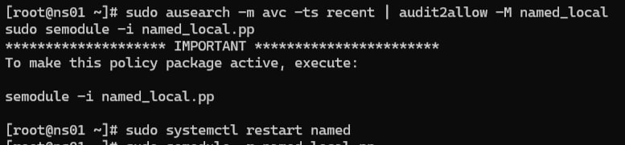
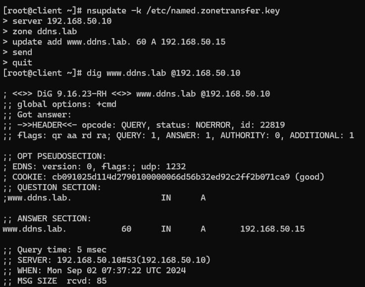
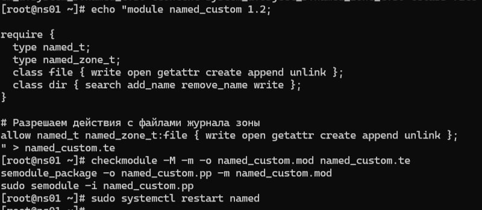
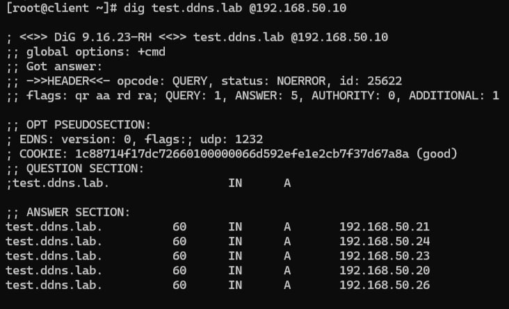

# Решение проблемы с обновлением зоны DNS при включенном SELinux

## Описание проблемы

Инженер настроил следующую схему:

- **ns01** - DNS-сервер (192.168.50.10)
- **client** - клиентская рабочая станция (192.168.50.15)

При попытке удаленно (с рабочей станции) внести изменения в зону `ddns.lab` происходит следующее:

```bash
[vagrant@client ~]$ nsupdate -k /etc/named.zonetransfer.key
> server 192.168.50.10
> zone ddns.lab
> update add www.ddns.lab. 60 A 192.168.50.15
> send
update failed: SERVFAIL
```

Инженер перепроверил содержимое конфигурационных файлов и, убедившись, что с ними всё в порядке, предположил, что данная ошибка связана с SELinux. 

## Проверим, почему это происходило?

Выполним команду для проверки логов SELinux:

```bash
sudo ausearch -m avc -ts recent
```

Вывод покажет следующее:

```bash
type=AVC msg=audit(1725271860.585:881): avc:  denied  { write } for  pid=3401 comm="isc-net-0001" name="named.ddns.lab.view1.jnl" dev="dm-0" ino=68931451 scontext=system_u:system_r:named_t:s0 tcontext=system_u:object_r:named_zone_t:s0 tclass=file permissive=0
```

- **`avc:  denied  { write } for  pid=3401`** - запрет на запись для нашего процесса.
- **`name="named.ddns.lab.view1.jnl"`** - файл, в который должна была произойти запись.

После изучения журналов и логов ясно, что проблема вызвана блокировками SELinux — он мешает процессу `named` (DNS-серверу) записывать изменения в файлы зоны.

## Способы решения

Протестируем несколько разных способов решить проблему и выберем оптимальный.

### Способ 1: Создание пользовательского модуля SELinux с помощью `audit2allow`

Попробуем использовать `audit2allow`, чтобы автоматически создать необходимые разрешения для SELinux на основе заблокированных действий.

- **Команды:**
  ```bash
  sudo ausearch -m avc -ts recent | audit2allow -M named_local
  sudo semodule -i named_local.pp
  ```
  
  

_Создание audit2allow модуля_

- **Что хорошего:**
  - Быстро и легко. SELinux сам создает необходимые правила.
  
- **Что нехорошего:**
  - Иногда разрешает больше, чем нужно, что может снизить безопасность, но разрешение контролирует всё равно администратор.

  

_Повтор попытки добавления после применения политики_

---

### Способ 2: Включение SELinux Boolean

Используем специальный параметр (`boolean`) в SELinux, чтобы разрешить DNS-серверу записывать в файлы зоны.

- **Команда:**
  ```bash
  sudo setsebool -P named_write_master_zones 1
  ```

- **Что хорошего:**
  - Еще более просто и быстро.

- **Что нехорошего:**
  - Разрешает все записи для `named`, что может быть небезопасно.

---

### Способ 3: Перевод домена `named_t` в режим `permissive`

Мы временно переводим процессы BIND `named` в режим `permissive`, чтобы SELinux не блокировал никаких действий.

- **Команда:**
  ```bash
  sudo semanage permissive -a named_t
  ```

- **Что хорошего:**
  - Отлично для временного тестирования и устранения проблем.

- **Что нехорошего:**
  - Снижает уровень безопасности, так как отключает SELinux для процесса `named`.

---

### Способ 4: Создание кастомного модуля SELinux вручную

Попробуем создать кастомный модуль SELinux, чтобы точно определить, какие действия разрешить.

- **Команды:**
  ```bash
  echo "module named_custom 1.2;

  require {
    type named_t;
    type named_zone_t;
    class file { write open getattr create append unlink };
    class dir { search add_name remove_name write };
  }

  # Разрешаем действия с файлами журнала зоны
  allow named_t named_zone_t:file { write open getattr create append unlink };
  " > named_custom.te
  ```
  ```bash
  checkmodule -M -m -o named_custom.mod named_custom.te
  semodule_package -o named_custom.pp -m named_custom.mod
  sudo semodule -i named_custom.pp
  ```



_Создание кастом модуля_

- **Что хорошего:**
  - Мы сами решаем, что именно разрешено.
  - Наивысшая безопасность.

- **Что нехорошего:**
  - Требует намного больше времени и усилий, чтобы написать и установить политику.



_Вывод после различных методов исправления_

---

## Выбор и обоснование для дальнейшей работы

Ответим на вопрос [что где когда](https://www.youtube.com/watch?v=r7llGNHc7rg) стоит использовать из способов.

- **Способ 1:** Создание пользовательского модуля SELinux с помощью `audit2allow`. Высокий уровень безопасности, т.к. разрешает только те действия, которые были заблокированы и которые мы решили разрешить. Плюс, удобство контроля разрешений. Выполняется по сути в две команды, то есть очень просто.

- **Способ 2:** Включение SELinux Boolean. Средний уровень безопасности. Очень простой способ, по сути включается одной командой, но уже менее безопасно, т.к. правило применяется глобально ко всем процессам named, хоть и только для выполнения записей в файлы мастер-зон. Если процессы скомпрометируют, то будет печально, можно совершать атаки типа DNS Poisoning, добавление ложных зон, повреждение DNS-записей и другие. 

- **Способ 3:** Перевод домена `named_t` в режим `permissive`. Безопасность для конкретной зоны отсутствует, по сути отключает защиту SELinux для определенной зоны. Данный способ точно не будем использовать, ввиду его небезопасности, пусть даже для тестовых сред.

- **Способ 4:** Создание кастомного модуля SELinux вручную. Наилучшая безопасность, так как мы точечно разрешаем определенные действия и все зависит только от нас. Но требуются определенный уровень знаний и подготовка, требуется время на создание, тестирование и проверку. Лучший выбор для прод серверов.

По итогу выбираем **Способ №1**, так как он оказался довольно-таки прост в настройке и обеспечивает гораздо более точечную и высокую безопасность по сравнению со 2-м и 3-м способами. 

P.S. **Способ 4** хоть и обеспечивает наивысшую безопасность, но для наших тестовых сред по сути избыточен. Запишем его на карандаш, будем использовать в продакшн.
