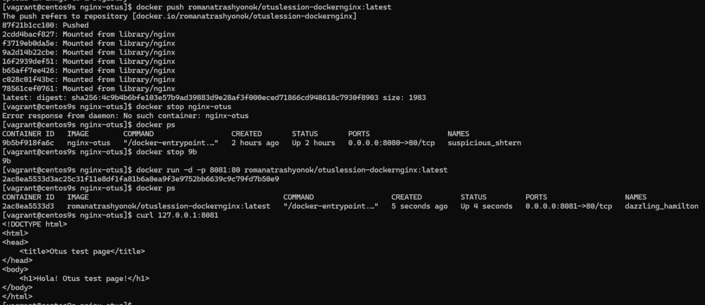

## Порядок выполнения

1. Установили Docker(уже включает в себя Docker Compose).
2. Написали `Dockerfile` с кастомной страницей Nginx и собрали с него образ на базе Alpine Linux. 
3. Проверили работоспособность образа и вывод curl.
4. Залогинились через docker login и запушили контейнер в Hub https://hub.docker.com/r/romanatrashyonok/otuslession-dockernginx.
```bash
docker pull romanatrashyonok/otuslession-dockernginx
```
5. Создали с нашего образа в Hub еще один контейнер, чтобы убедится что все ок. Все ок.

  

_Проверка нашего образа с Docker Hub_


## Можно ли в контейнере собрать ядро?

Да, это возможно, и такой способ используется довольно часто, так как у него есть свои плюсы:

- **Изоляция**: Docker позволяет создать изолированную среду для сборки, что означает, что изменения в процессе сборки не затронут основную систему.
- **Кросс-компиляция**: Docker позволяет легко настраивать окружение для сборки ядра для других архитектур.

Однако, есть и минусы:

- **Медленнее**: Сборка в контейнере может быть заметно медленнее, чем сборка напрямую на хосте, так как присутствует дополнительный уровень контейнеризации.
- **Меньший контроль**: Контейнеры могут не предоставлять такого же уровня контроля над всеми процессами при сборке, как при прямой сборке на хосте.

## Пример выполнения действий

1. **Создание Dockerfile**: Укажите команды для скачивания пакетов и зависимостей для сборки ядра.
2. **Создание Docker-образа**: Настройте скачивание исходников и подготовьте директории для сборки.
3. **Запуск контейнера**: Создайте контейнер на основе Docker-образа.
4. **Сборка ядра**: Выполните сборку ядра с помощью `make` внутри контейнера. Это можно автоматизировать в Dockerfile, чтобы ядро собиралось сразу при создании образа.
5. **Копирование ядра на хост**: Скопируйте собранное ядро из контейнера на хост-машину с помощью команды `docker cp`.

---

## Разница между Docker контейнером и образом

- **Образ** — это шаблон для создания контейнеров. Можно представить как изначальную программу, например, Телеграм.
- **Контейнер** — это работающий (или запущенный ранее) экземпляр образа со своими параметрами и данными, которые не влияют на исходный образ. Это как запущенная (или незапущенная, но уже с имеющимися данными) программа под пользователем. Куки, кэш, настройки темы, чаты и т.д., хранятся отдельно от самой программы как слои и не перезаписывают исходный код. Программа может иметь несколько профилей пользователей, которые не влияют друг на друга и на саму программу — так же, как и контейнеры, которые могут работать с одного и того же образа, не завися друг от друга.

