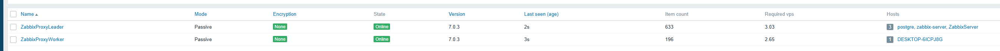
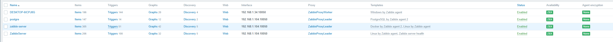
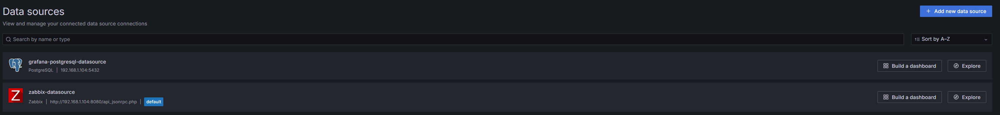
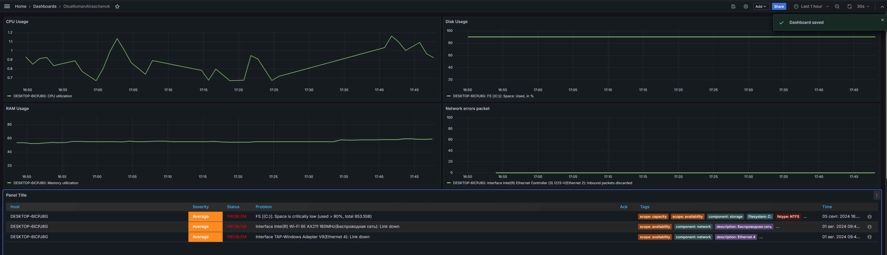

# Настройка мониторингового дашборда

Настройка комплексного дашборд мониторинга с четырьмя ключевыми метриками (ЦПУ, ОЗУ, диск, сеть) с использованием Zabbix и Grafana. 

## Шаги

1. **Создание конфигурации Docker Compose**: Написал `docker-compose` файл для запуска нескольких контейнеров:
   - Zabbix Server (порт 10051)
   - Zabbix PostgreSQL Database (порт 5432)
   - Zabbix Nginx (порт 8080)
   - Grafana (порт 3000)

2. **Запуск контейнеров**: Запустил контейнеры с помощью Docker Compose.

3. **Установка агентов Zabbix**: Установил Zabbix-агенты на сервер и хост, где находится сервер.

4. **Настройка Zabbix-сервера**:
   - Добавил пассивные Zabbix-прокси в настройках Zabbix.
     

_Добавленные Zabbix-прокси_
---

   - Добавил хосты с установленными агентами.
     

_Добавленные хосты_

5. **Развертывание Docker Swarm**: Развернул кластер Docker Swarm на двух других ВМ с пассивными Zabbix-прокси.

6. **Добавление шаблонов в Zabbix**: Назначил необходимые шаблоны на хосты в Zabbix.

7. **Настройка источников данных в Grafana**: Добавил источники данных PostgreSQL и Zabbix сервера в Grafana.
  

_Настройка источников данных_

8. **Создание дашборда в Grafana**: Создал новый дашборд и добавил 4 панели (утилизация ЦПУ, ОЗУ, диск, сеть), а также панель с триггерами.
  

_Готовый дашборд в Grafana_

