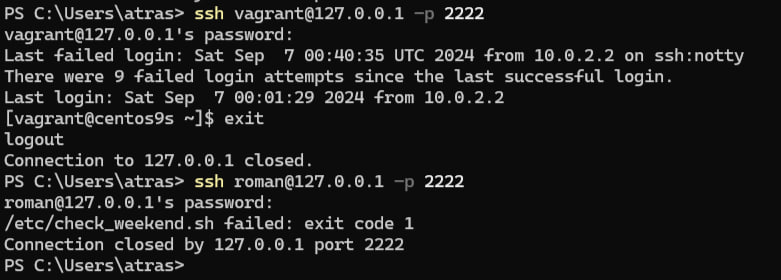

### Задача

1. **Запрет входа в систему по SSH всем пользователям, кроме группы `admin`, в выходные (суббота и воскресенье).**
2. **Предоставление пользователю `roman` прав для работы с Docker и возможности перезапускать сервис Docker.**

### Описание

1. **Установка необходимых пакетов:**
   - Устанавливаются Docker и PAM.

2. **Создание пользователя `roman`**

3. **Создание группы `admin` и добавление пользователей:**
   - Создается группа `admin`, в которую добавляются пользователи `root` и `vagrant`, чтобы им был разрешен вход в систему в выходные дни.

4. **Предоставление прав пользователю `roman` для работы с Docker:**
   - Пользователь `roman` добавляется в группу `docker`, чтобы иметь права на выполнение Docker-команд.
   - Пользователю `roman` также предоставляются права на перезапуск Docker без ввода пароля с использованием команды `sudo`.

5. **Настройка PAM для ограничения входа в выходные дни:**
   - Загружается и устанавливается скрипт `check_weekend.sh`, который выполняется через PAM и проверяет, пытается ли пользователь войти в систему в выходные.
   - Если день недели — суббота или воскресенье, доступ запрещается всем пользователям, кроме тех, кто входит в группу `admin`.

6. **Настройка SELinux и перезапуск SSH сервера:**
   - Контекст SELinux устанавливается для скрипта `check_weekend.sh`, чтобы разрешить его выполнение.
   - SSH сервер перезапускается для применения изменений.

  

_Проверка настроенного входа_