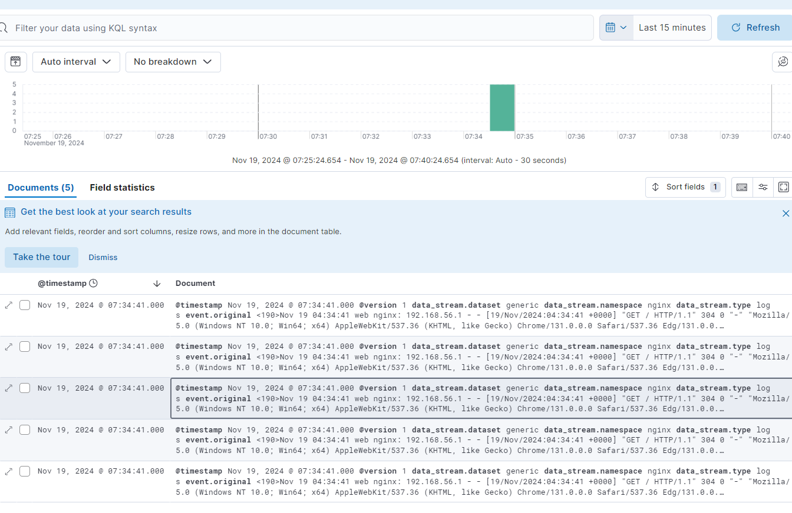
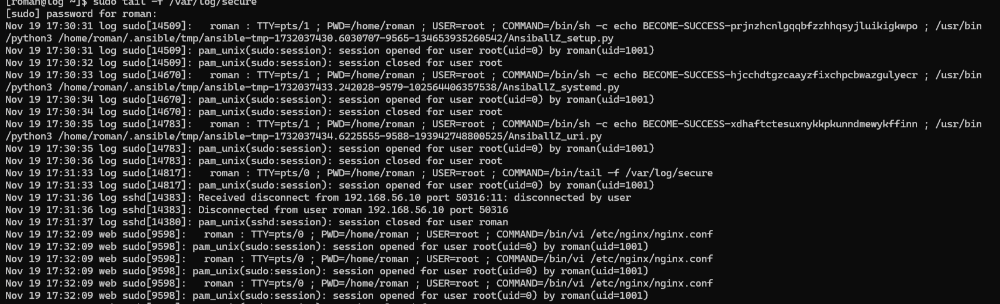

# **Развертывание логирования на rsyslog и ELK**

---

## **Задача**  

Развернуть две виртуальные машины:  

1. **`web`**: Установить и настроить **Nginx**.  
2. **`log`**: Настроить две системы логирования: **rsyslog** и **ELK**.

---

### **Требования**  

1. **Аудит:**  
   Отслеживать изменения конфигурации **Nginx**.  
2. **Сбор логов:**  
   - Логи **Nginx** направлять в **ELK**.  
   - Критичные логи с **`web`** сохранять локально и отправлять в **rsyslog** на **`log`**.  
   - Логи аудита отправлять в **rsyslog** на **`log`**.

---

### **Формат сдачи**  

Реализация через **Vagrant** и **Ansible**.

---

## **Описание выполнения**

### 1. **Запуск Vagrant**

Используем `Vagrantfile` (из предыдущих заданий) для создания виртуальных машин **`web`** и **`log`**.

---

### 2. **Настройка серверов**

Выполняем основной **Ansible-плейбук**, который:  

- Настраивает **Nginx** и **rsyslog** на **`web`**.  
- Разворачивает **rsyslog** и **ELK** на **`log`**.  

---

### 3. **Добавление Data Stream в ELK**

Дополнительный плейбук создает **Data View** в **Kibana** для отображения логов **Nginx**.

---

## **Описание плейбуков**

### **Основной плейбук**

---

#### **1. Настраиваем сервер `web`**

- **Устанавливаем Nginx:**  
  Устанавливаем и запускаем веб-сервер для обработки запросов.

- **Настраиваем логи Nginx:**  
  - Логи запросов (`access_log`) отправляем в **ELK (Logstash)** через syslog на порт **5044**.  
  - Логи ошибок (`error_log`) сохраняем локально, но только если они критичные.

- **Запускаем и включаем автозапуск Nginx.**

---

#### **2. Настраиваем rsyslog на `web`**

- **Отправляем критичные логи:**  
  Логи уровня **`crit`** (`*.=crit`) пересылаются на **`log`** и остаются локально.

- **Отправляем логи аудита:**  
  Логи, отслеживающие изменения конфигурации **Nginx**, отправляются на **`log`**.

- **Применяем изменения в rsyslog:**  
  Перезапускаем **rsyslog**, чтобы применить новую конфигурацию.

---

#### **3. Настраиваем сервер `log`**

- **Подготавливаем сервер для ELK:**  
  - Увеличиваем объем виртуальной памяти для работы **Elasticsearch**.  
  - Устанавливаем **Docker** и необходимые зависимости.

- **Разворачиваем ELK:**  
  - Через **Docker Compose** запускаем **Elasticsearch**, **Logstash** и **Kibana**.  
  - Настраиваем **Logstash** на прием логов **Nginx** по порту **5044 (UDP)**.  

- **Настраиваем обработку логов Nginx:**  
  - **Logstash** принимает логи, распознает их как **Nginx**, обрабатывает (парсит через **grok**) и отправляет в **Elasticsearch**.  
  - Логи передаются в **Data Streams** для удобного управления и анализа.  

---

## **Дополнительный плейбук**

1. **Указываем настройки:**  
   - Адрес **Kibana**: `http://localhost:5601`.  
   - Имя **Data View**: `logs-generic-nginx*`.  
   - Поле времени: `@timestamp`.

---

2. **Проверяем работу Docker:**  

   Убеждаемся, что **Docker** запущен, поскольку **ELK** работает в контейнере.

---

3. **Создаем Data View в Kibana:**  

   - Отправляем **POST-запрос** в **API Kibana** для создания **Data View**.  
   - Указываем, что логи **Nginx** будут фильтроваться и отображаться по времени (`@timestamp`).  

---

### **Скриншоты работы:**

#### _Логи Nginx в ELK_  

#### _Логи аудита в rsyslog на сервере log_  

---

## **Результаты**

1. Логи **Nginx** попадают в **ELK**. В **Kibana** можно будет анализировать запросы к сайту и ошибки.  
2. Локально на **`web`** остаются только критичные ошибки.  
3. Логи аудита и критичные системные логи сохраняются в **rsyslog** на **`log`**.  

