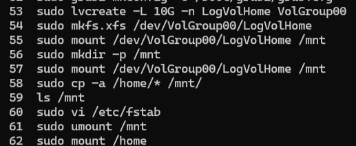

# Результаты выполнения заданий

## 1. Уменьшить том под `/` до 8G
Создали временный том на 8 ГБ для переноса данных с текущего корневого тома и перенесли файлы при помощи `rsync`. Обновили настройки загрузки для использования временного корневого тома и ребутнули систему, чтобы проверить, что все четко. (все четко получилось только на третий день выполнения).

*Результат создания временного тома*

Так как уменьшить XFS нельзя, пересоздали том на 8 ГБ, снова мигрировали данные на новый основной том с временного, обновили `fstab` под новый корневой том. После этого ребутнули систему и проверили её работоспособность. Временный том был удален.

*history*

---

*Результат создания постоянного тома*

## 2. Выделить том под `/home`
Создали новый том для `/home` на 10 ГБ на разделе `sda3` и настроили его монтирование, предварительно скопировав все данные с предыдущего тома. Снова fstab, ребут, проверка.

*history*

---

*Результат выделения тома под `/home`*

## 3. Выделить том под `/var` (сделать в mirror)
С помощью `mdadm` настроили RAID1 с использованием дисков `sdc` и `sdd`, смонтировали его в `/var`, скопировали данные из предыдущего `/var`, обновили `fstab` и ребутнули систему.

*history*

---

*Результат выделения тома под `/var`*

## 4. Создание тома для снапшотов `/home`
Для тома `/home` создали другой том для хранения снапшотов (`LogVolHomeSnap`).

*Результат создания тома под снапшоты*

## 5. Прописать монтирование в `fstab`
Вывели `blkid`, чтоб получить все разделы и типы их систем, отредактивали fstab под UUID (так файл выглядит опрятнее). Файл приложен к заданию отдельно.

## 6. Работа со снапшотами
Создали несколько файлов, сделали и смонтировали снапшот, удалили файлы и восстановили их из снапшота. Результат на скриншоте.

*Результат проверки работы снапшотов*

## 7. Задание со звездочкой*

### Работа с Btrfs
На оставшемся пространстве `sda3` создали LVM-раздел с файловой системой Btrfs и замонтировали его в `/mnt/btrfs`. Проверили работу снапшотов: touch файлов, создали снап, rm файлов, востановление из снапшота. Работает очень легко и просто.

*Результат проверки работы снапшотов Btrfs*

### Работа с ZFS
На диске `sdb` создали ZFS пул `zfspool` с кэшем на диске `sde`. Настроили монтирование `/opt` в ZFS. Как и для Btrfs, проверили работу снапшотов: работает очень круто, просто и удобно.

*Результат проверки работы снапшотов ZFS*

После этого также обновили `fstab` и ребутнули систему.

*Результат создания томов с Btrfs и ZFS*
