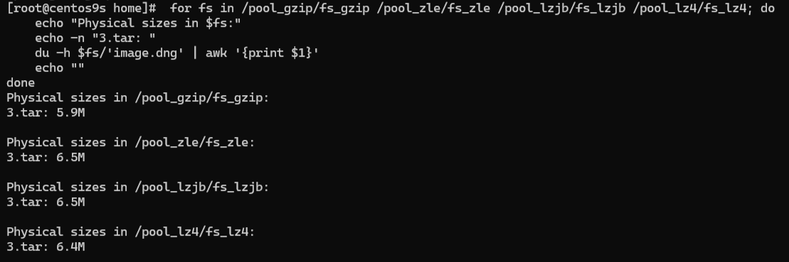
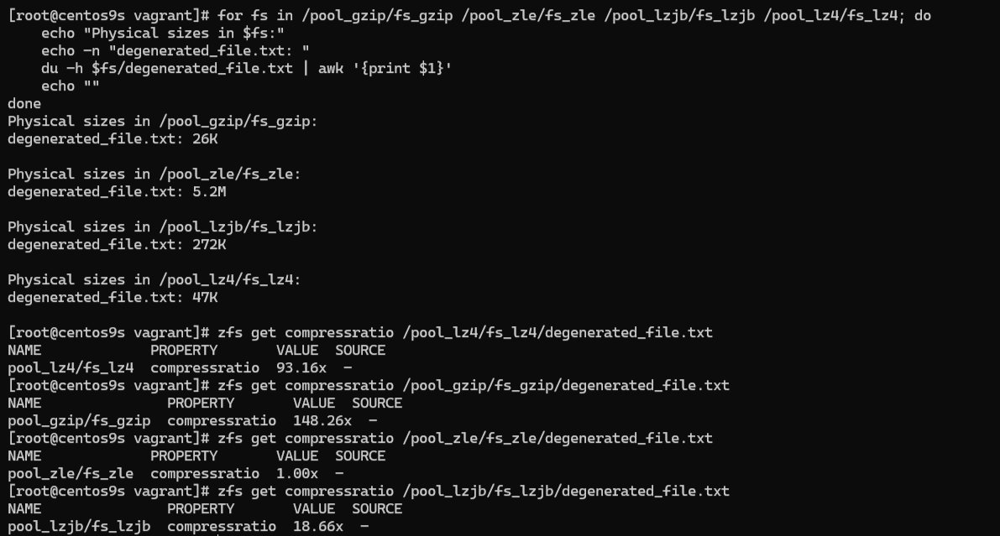
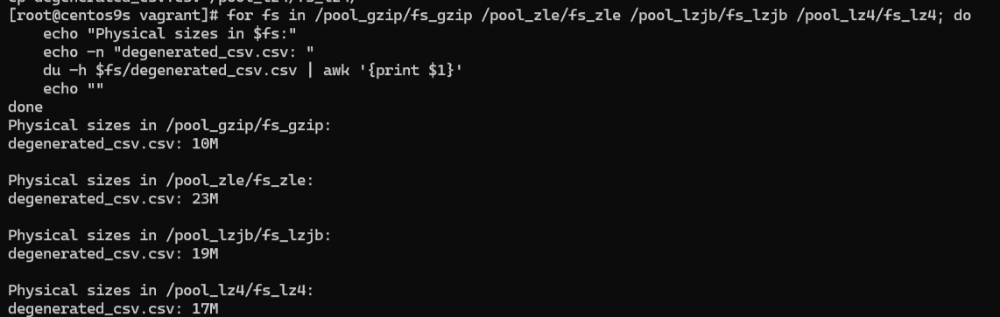
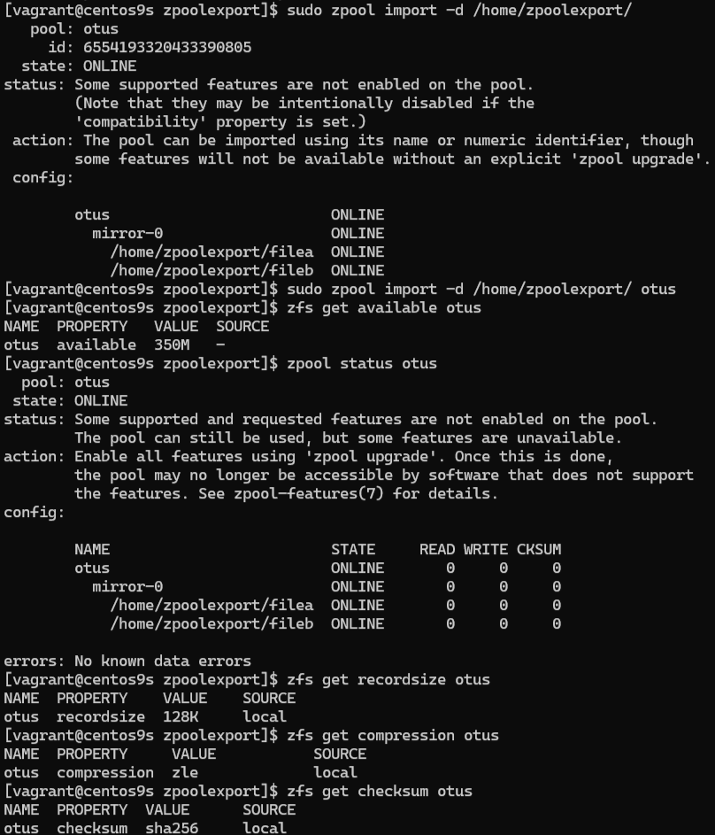
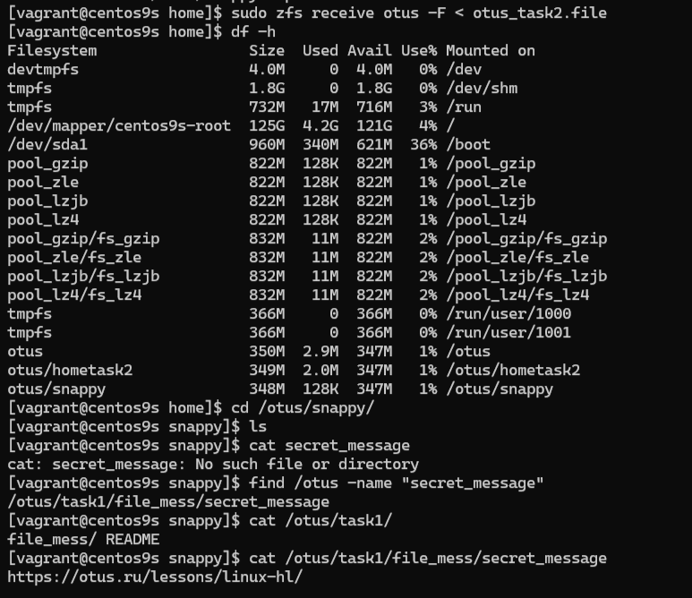

# Практические навыки работы с ZFS

## Что нужно сделать?

### 1) Определить алгоритм с наилучшим сжатием:
- Создал 4 пула из 4 дисков специально под каждый тип сжатия в файловой системе, применил типы сжатия с помощью `zfs set compression`.
- Закинул в каждую ФС заранее созданные 2 файла различных типов (txt и csv), а также изображение dng (необработанный формат Adobe).
- После чего при помощи цикла (так удобнее) получил данные о размере каждого файла (результаты на скриншотах).
  - ZLE практически не сжимал наши данные, вне зависимости от типа файла.
  - Изображение по сути смог сжать только gzip (примерно -10%).
    

    *Результат сжатия изображения*
  - TXT файлы лучше всего были сжаты gzip (26кб) и lz4 (47кб).
    

    *Результат сжатия txt файла*
  - С CSV файлами также лучше всех справился gzip, с почти двухкратным преимуществом от остальных типов.
    

    *Результат сжатия csv файла*

### 2) Определить настройки пула:
- **Размер хранилища** (ответ 350M):
  ```
  [vagrant@centos9s zpoolexport]$ zfs get available otus
  NAME  PROPERTY   VALUE  SOURCE
  otus  available  350M   -
  ```
- **Тип pool** (ответ mirror-0):
  ```
  [vagrant@centos9s zpoolexport]$ zpool status otus
    pool: otus
    state: ONLINE
    status: Some supported and requested features are not enabled on the pool.
            The pool can still be used, but some features are unavailable.
    action: Enable all features using 'zpool upgrade'. Once this is done,
            the pool may no longer be accessible by software that does not support
            the features. See zpool-features(7) for details.
    config:

            NAME                         STATE     READ WRITE CKSUM
            otus                         ONLINE       0     0     0
              mirror-0                   ONLINE       0     0     0
                /home/zpoolexport/filea  ONLINE       0     0     0
                /home/zpoolexport/fileb  ONLINE       0     0     0
  ```
- **Значение recordsize** (ответ 128K):
  ```
  [vagrant@centos9s zpoolexport]$ zfs get recordsize otus
  NAME  PROPERTY    VALUE    SOURCE
  otus  recordsize  128K     local
  ```
- **Используемое сжатие** (ответ zle):
  ```
  [vagrant@centos9s zpoolexport]$ zfs get compression otus
  NAME  PROPERTY     VALUE           SOURCE
  otus  compression  zle             local
  ```
- **Используемая контрольная сумма** (ответ sha256):
  ```
  [vagrant@centos9s zpoolexport]$ zfs get checksum otus
  NAME  PROPERTY  VALUE      SOURCE
  otus  checksum  sha256     local
  ```
  

  *Результаты проверки*

### 3) Работа со снапшотами:
- При помощи `zfs receive` и `cat` получили зашифрованное сообщение ([Учебный курс](https://otus.ru/lessons/linux-hl/)).
  

  *Результаты восстановления снапа и получения сообщения*

