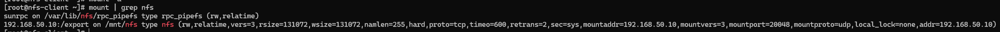
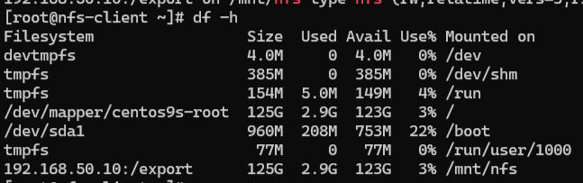
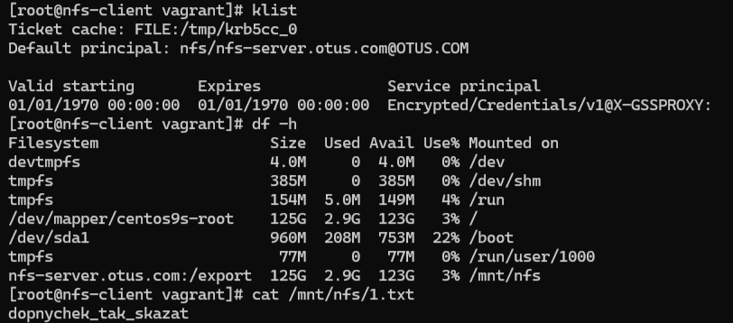

# Настройка NFS сервера и клиента через Vagrant

Этот проект настраивает сервер и клиент NFS с использованием Vagrant и CentOS 9 Stream.

## Настройка сервера NFS (`nfs-server`)

1. **Установка программ**: Сервер получает все необходимые программы для работы с NFS.
2. **Запуск служб NFS**: Службы NFS и rpcbind активируются и запускаются.
3. **Подготовка директории**: Создается директория `/export/upload` с открытыми правами доступа.
4. **Конфигурация NFS**: В файл `/etc/exports` добавляются правила, обеспечивающие доступ клиентов к серверу.
5. **Настройка фаервола**: Конфигурируется фаервол для доступа к NFS.

## Настройка клиента NFS (`nfs-client`)

1. **Установка программ для NFS**: Клиенту устанавливаются программы, аналогичные серверу.
2. **Монтирование**: Создается точка монтирования `/mnt/nfs`.
3. **Автоматическое монтирование при загрузке**: В файл `/etc/fstab` добавляется запись для NFS.
4. **Монтирование файловых систем**: Выполняется монтирование всех файловых систем при старте.



*Результат создания*

### Пример работы

Создание файла на сервере и проверка его доступности на клиенте:

Создаем файл `otus.txt` на сервере:
```bash
# На сервере
cd /export/upload
touch otus.txt
echo "OtusOtus" > otus.txt
```

Проверяем на клиенте:
```bash
# На клиенте
cd /mnt/nfs/upload
ls -l
cat otus.txt
total 4
-rw-r--r--. 1 root root 9 Aug 25 22:39 otus.txt
OtusOtus
```


*Вывод df*
Это говорит нам о том, что задание выполнено успешн

## Дополнительное задание: Настройка NFS4 с Kerberos

### Что происходит в процессе настройки

**Настройка сервера NFS (`nfs-server.otus.com`):**
1. **Установка программ**: Добавляются NFS и Kerberos.
2. **Настройка связи**: В `hosts` добавляются адреса для связи.
3. **Подготовка места для файлов**: Создается `/export/upload`.
4. **Настройка Kerberos**: Конфигурируется защита.
5. **Запуск служб**: Стартуют службы NFS и Kerberos.

**Настройка клиента NFS (`nfs-client.otus.com`):**
1. **Установка программ**: Устанавливаются NFS и Kerberos.
2. **Настройка связи**: Обновляется файл `hosts`.
3. **Настройка фаервола и Kerberos**: Конфигурируются для безопасной связи.
4. **Получение доступа к серверу**: Получение "билета" Kerberos.
5. **Подключение к файловой системе**: Монтируется NFS с защитой Kerberos.

### Результат работы



*Результат после создания файла на сервере*

После запуска `vagrant up` все настройки выполняются автоматически, создавая готовую к использованию среду для работы с файлами через сеть с защитой Kerberos.
