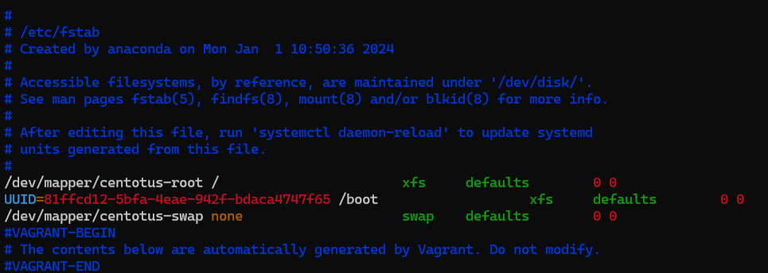
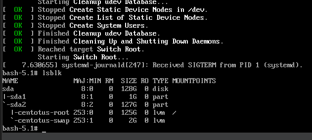
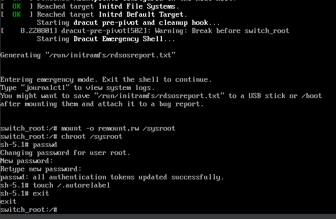
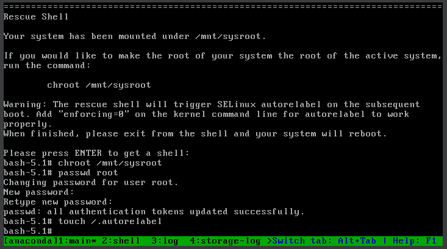

# Задание

## 1) Установить систему с LVM, после чего переименовать VG

Так как мы используем стандартный CentOS 9 Stream, то уже сразу получаем LVM для корневого каталога `/`. Остается только узнать и сменить название VG.

```bash
NAME              FSTYPE      FSVER    LABEL UUID                                   FSAVAIL FSUSE% MOUNTPOINTS
sda
├─sda1            xfs                  boot  81ffcd12-5bfa-4eae-942f-bdaca4747f65    752.1M    22% /boot
└─sda2            LVM2_member LVM2 001       akdxjz-PVyH-PQkQ-Mphk-5Ecu-DnyM-xCQpSL
  ├─centos9s-root xfs                  root  42bae4f6-3138-4709-b69a-476ae385b307    122.2G     2% /
  └─centos9s-swap swap        1              f7767600-27fe-4f53-8a05-a0c5b63edcda                  [SWAP]
```

При помощи `vgrename` меняем название на `centotus`. Затем обновляем `/etc/fstab`, чтобы не было записей о старом названии `centos9s`. 



_Обновляем `/etc/fstab`_

После этого выполняем:

```bash
sudo dracut -f -v
```

для обновления initramfs.

## 2) Включить отображение меню Grub

Открываем через `vi` файл `/etc/default/grub` и редактируем следующие параметры:

```bash
GRUB_TIMEOUT=7              # 7 секунд тайм-аута
GRUB_TIMEOUT_STYLE=menu     # отображение меню Grub
GRUB_CMDLINE_LINUX="biosdevname=0 no_timer_check vga=792 nomodeset text crashkernel=1G-4G:192M,4G-64G:256M,64G-:512M resume=/dev/mapper/centotus-swap rd.lvm.lv=centotus/root rd.lvm.lv=centotus/swap net.ifnames=0" # тут поменяли старое название VG на новое
```

После чего обновляем конфигурацию Grub:

```bash
sudo grub2-mkconfig -o /boot/grub2/grub.cfg
```

Перезагружаем систему и проверяем работу после смены названия VG и установки показа меню GRUB.

## 3) Попасть в систему без пароля несколькими способами

Попробуем три способа:

### a) `init=/bin/bash` в Grub

При перезагрузке системы, на экране Grub нажимаем `e` у нужного ядра, и в появившемся меню находим строку с началом на `linux` и в самом конце добавляем `init=/bin/bash`. После этого нажимаем `Ctrl+X` и заходим в систему без пароля.



_Вход без пароля_

### b) `rd.break` в Grub

Повторяем действия как и в предыдущем методе, но в конце строки `linux` добавляем `rd.break`. Нажимаем `Ctrl+X`, попадаем в emergency mode, монтируем файловую систему в режим записи через:

```bash
mount -o remount,rw /sysroot
chroot /sysroot
```

Устанавливаем новый пароль при помощи `passwd`, вводим `touch /.autorelabel`, так как у нас включен SELinux. Затем выходим из chroot, перезагружаем систему и заходим под новым паролем root.



_Сброс через rd.break_

### c) Live CD для сброса

В нашей ВМ в VirtualBox добавляем новый оптический диск с образом CentOS 9 Stream, меняем приоритет загрузки на него, заходим в `Troubleshooting` → `Rescue a CentOS Linux system`. Выбираем `1` для продолжения, затем выполняем:

```bash
chroot /mnt/sysroot
```

Меняем пароль root через `passwd`, устанавливаем `touch /.autorelabel`, так как у нас включен SELinux. После этого перезагружаем систему и заходим под новым паролем.



_Сброс через live-cd_

